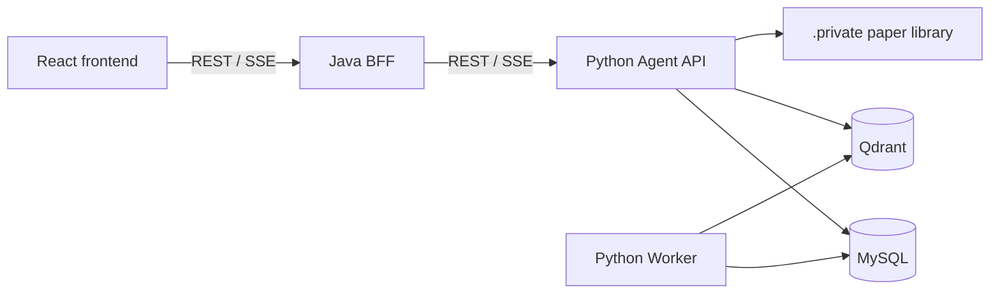

# AIResearcher

AIResearcher 是一个面向论文知识库与长期科研自动化的单仓库项目。仓库名暂为 ScholarAgent，产品名、包名和项目文档统一使用 AIResearcher。

## 当前状态

v0.1 单篇论文 Demo 纵向切片已经落地：React 只经 Java BFF 调用 Python Agent，支持文本型 PDF 上传、后台建库、浏览器原生预览、DeepSeek 原生 Tool Calling、Qdrant 检索、本地 Rerank、SSE 回答和页码引用。`FakeChatProvider` 只保留在无外部依赖的测试中，不是默认运行时。

本地开发默认通过 Docker Compose 运行 MySQL 8.4 与 Qdrant 1.19，不依赖宿主机 MySQL 服务；数据库和向量数据保存在仓库外的 Docker named volume 中。

v0.1 的核心目标不是一次铺开所有科研自动化能力，而是完成一条可以真实使用的闭环：

```text
上传单篇 PDF → 自动解析与建库 → Web 预览
→ 用户提问 → Agent 自主调用工具
→ RAG 检索 → Rerank → LLM 流式回答
→ 展示并跳转到论文页码引用
```

## 仓库结构

| 目录 | 职责 |
| --- | --- |
| `frontend/` | React Web 客户端 |
| `backend/` | Java Web Backend/BFF |
| `agent/` | Python Agent API、RAG 与 Worker |
| `contracts/` | Web API、Agent API 与 SSE 契约 |
| `infrastructure/` | 本地基础设施配置，不保存运行数据 |
| `docs/` | 架构、路线、开发流程和 ADR |
| `scripts/` | 跨平台开发与验证脚本 |
| `.github/` | GitHub Actions 与仓库协作配置 |

## 应用边界



- React 只访问 Java 的 `/api/v1/**`。
- Java 负责 Web API、统一响应、校验、错误映射、请求追踪与 SSE 转发。
- Python 负责论文和 AI 数据、解析、检索、Prompt、模型调用与后台任务，是这些数据的唯一事实来源。
- v0.1 使用 MySQL 任务表驱动轻量 Worker，不引入 Redis Streams；Java 保持无业务持久化。
- PDF 原件统一保存在被 Git 忽略的 `.private/paper-library/originals/`，上传和未来 MCP
  下载先进入 `.staging/`；数据库、PDF、向量、模型、密钥与日志均不得进入 Git。

完整边界见 [架构说明](docs/architecture.md)。

## 开发路线

- M0：可靠的契约、三端骨架和自动检查基线。
- M1：单篇文本型 PDF 上传、后台解析建库、状态展示和 Web 原生预览。
- M2：Qdrant 检索、真实 BGE embedding、本地 Rerank 和证据追踪。
- M3：DeepSeek 原生 Tool Calling、最小会话/Run 持久化和引用校验。
- M4：失败恢复、三端端到端、启动文档和 `v0.1.0` 验收。

v0.1 固定为单用户、本地优先、单默认知识库。批量上传、OCR、多知识库、Redis Streams、LangGraph、研究工作区和论文写作均延后。

首次安装、环境变量、一键启动、停止和排错见 [Windows 本地部署与启动](docs/deployment.md)；
自动检查与多 Chat/Worktree 协作见 [开发流程](docs/development.md)。

详细内容见 [路线图](docs/roadmap.md)。

## 多 Chat 协作

仓库长期保留 `codex/frontend`、`codex/backend`、`codex/agent`、`codex/docs` 和 `codex/test` 五个本地分支及 Worktree，分别维护三端应用、全部文档与契约、仓库级跨端测试。长期分支每次只承载一个边界明确的未完成任务，任务开始和合入后都以 fast-forward 方式同步本地 `main`。

跨子系统功能使用从最新本地 `main` 创建的 `codex/feature/<feature>-<slice>` 临时分支族；契约切片先合入 `main`，各消费者切片再并行实现。模块测试始终由模块 Chat 维护，`codex/test` 只负责根级 `tests/**`。所有分支均不推送、不创建 PR、不 rebase 或 reset，由 Local 集成 Chat 留在 `main` 串行审查和合并，最终由用户统一上传本地 `main`。

开始工作前请阅读：

- [开发环境与多 Chat 工作流](docs/development.md)
- 根目录及目标子目录中的 `AGENTS.md`
- [ADR 0002：本地论文原件库](docs/adr/0002-local-paper-library.md)

## 安全

仓库只接收代码、配置模板、迁移、合成测试数据和公开文档。真实 PDF 可以保存在仓库目录内
受控且被忽略的 `.private/` 边界中，但不得进入 Git；研究数据、`.env`、凭据、数据库文件、
向量数据、模型文件和运行日志同样不得提交。
