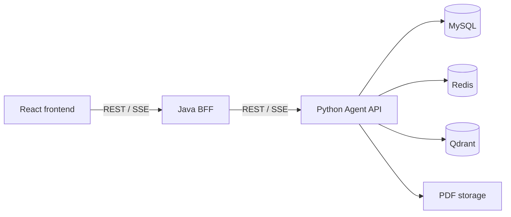

# AIResearcher

AIResearcher 是一个面向论文知识库与长期科研自动化的单仓库项目。仓库名暂为 ScholarAgent，产品名、包名和项目文档统一使用 AIResearcher。

## 当前状态

当前处于 Phase 0 的协作基线阶段：仓库结构、工程约束、分层 `AGENTS.md` 和开发文档已经建立，三个应用尚未生成可运行代码，也没有需要安装的项目依赖。

## 仓库结构

| 目录 | 职责 |
| --- | --- |
| `frontend/` | React Web 客户端 |
| `backend/` | Java Web Backend/BFF |
| `agent/` | Python Agent API、RAG 与 Worker |
| `contracts/` | Web API、Agent API 与 SSE 契约 |
| `infrastructure/` | 本地基础设施配置，不保存运行数据 |
| `docs/` | 架构、路线、开发流程和 ADR |
| `scripts/` | 跨平台开发与验证脚本 |
| `.github/` | GitHub Actions 与仓库协作配置 |

## 应用边界

- React 只访问 Java 的 `/api/v1/**`。
- Java 负责 Web API、统一响应、校验、错误映射、请求追踪与 SSE 转发。
- Python 负责论文和 AI 数据、解析、检索、Prompt、模型调用与后台任务。
- 数据库、PDF、向量、模型、密钥与日志均不得进入 Git。

完整边界见 [架构说明](docs/architecture.md)。

## 开发路线

- Phase 0：完成三端可运行骨架和 React -> Java -> Python Fake SSE 最小竖切。
- Phase 1：完成论文上传、解析、元数据、去重与索引。
- Phase 2：完成持久会话、全库 RAG、SSE 和引用校验。
- Phase 3：完成论文范围过滤、联调和 `v0.1.0` 验收。

详细内容见 [路线图](docs/roadmap.md)。

## 多 Chat 协作

后续任务从最新 `main` 创建独立 Worktree，一个 Chat 只负责一个边界明确的任务。共享契约由专门任务先行修改并合入，三端实现再基于更新后的 `main` 开始。

开始工作前请阅读：

- [开发环境与多 Chat 工作流](docs/development.md)
- 根目录及目标子目录中的 `AGENTS.md`
- [ADR 0001：三应用边界](docs/adr/0001-application-boundaries.md)

## 安全

仓库只接收代码、配置模板、迁移、合成测试数据和公开文档。真实 PDF、研究数据、`.env`、凭据、数据库文件、向量数据、模型文件和运行日志必须保留在 Git 之外。
