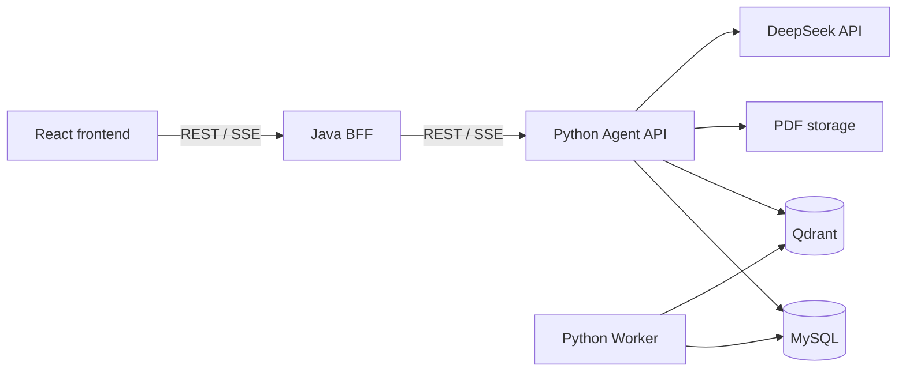

# AIResearcher

AIResearcher 是一个面向论文知识库与长期科研自动化的单仓库项目。当前已经完成可运行的
单篇论文 RAG 闭环，并以此为基础逐步扩展论文管理、深度阅读、研究规划、实验和科研写作。

## 当前能力

当前实现支持：

- React 仅通过 Java BFF 访问 Python Agent。
- 上传文本型 PDF，由 Python Worker 完成解析、按页切块和后台建库。
- 使用 BGE-M3 embedding、Qdrant 检索和本地 Rerank。
- 使用 DeepSeek 原生 Tool Calling 选择知识库检索或文档查询工具。
- 通过 SSE 返回工具状态、流式回答和可跳转到 PDF 页码的引用。
- 使用 MySQL 保存论文、任务、会话、Run 和引用等 Agent 数据。

```text
上传 PDF → 后台解析与建库 → Web 预览
→ 用户提问 → Tool Calling
→ 检索与 Rerank → SSE 流式回答
→ 展示论文证据与页码引用
```

本地论文原件库、目录扫描、原件状态以及排除/恢复接口已经完成机器可读契约，但
Agent、Backend、Frontend 和运行配置尚未实现这些新契约。当前运行时仍使用仓库外的
`AIRESEARCHER_STORAGE_DIR` 和现有单文件上传/删除流程，具体进度见
[长期路线图](docs/roadmap.md)。

## 调用链



- React 只访问 Java 的 `/api/v1/**`。
- Java 负责浏览器 API、校验、错误映射、请求追踪和 SSE/PDF 转发。
- Python 是论文文件、入库、检索、Prompt、模型调用及 AI 数据的唯一事实来源。

完整边界见 [架构说明](docs/architecture.md)。

## 仓库结构

| 目录 | 职责 |
| --- | --- |
| `frontend/` | React Web 客户端 |
| `backend/` | Java Web Backend/BFF |
| `agent/` | Python Agent API、RAG 与 Worker |
| `contracts/` | Agent API、Web API 与 SSE 契约 |
| `infrastructure/` | 本地 MySQL、Qdrant 开发配置 |
| `scripts/` | 本地启动与验证辅助脚本 |
| `docs/` | 架构、路线图和部署文档 |

各模块的目录结构、入口和检查命令保存在对应模块的 `README.md`。

## 快速开始

当前完整运行环境面向 Windows 10/11。首次安装、环境变量、版本要求、一键启动、手动启动、
停止和排错请阅读 [Windows 本地部署与运行](docs/deployment.md)。

```powershell
Copy-Item .\.env.example .\.env
# 编辑 .env 后：
.\scripts\start-dev.ps1 -CheckOnly
.\scripts\start-dev.ps1
```

启动完成后访问 <http://127.0.0.1:5173>。

## 文档入口

- [当前架构与系统边界](docs/architecture.md)
- [阶段路线图与长期科研闭环](docs/roadmap.md)
- [Windows 本地部署与运行](docs/deployment.md)
- [AI 仓库执行规则](AGENTS.md)
- [机器可读接口契约](contracts/README.md)

## 数据安全

`.env`、API Key、密码、真实 PDF、数据库、向量、模型、缓存和日志不得提交到 Git。
当前 PDF storage 和模型缓存必须位于仓库外；MySQL 与 Qdrant 数据保存在 Docker named
volume 中。仓库只接收代码、非敏感配置模板、迁移、合成测试数据和公开文档。
