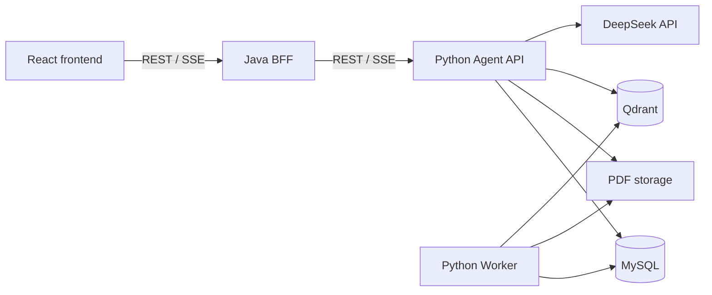

# AIResearcher 当前架构

本文只描述已经落地的系统结构和运行约束。尚未实现的能力及进入顺序见
[阶段路线图](roadmap.md)。

## 1. 系统组成

AIResearcher 是一个单仓库中的三个应用：

```text
AIResearcher/
├─ frontend/          React Web 客户端
├─ backend/           Java Web Backend/BFF
├─ agent/             Python Agent API、RAG 与 Worker
├─ contracts/         Agent API、Web API 与 SSE 契约
├─ infrastructure/    本地 MySQL 与 Qdrant 配置
├─ scripts/           开发启动与验证脚本
└─ docs/              架构、路线图与部署文档
```



浏览器不得绕过 Java 直连 Python。Java 不直接访问 MySQL、Qdrant 或 PDF storage。

## 2. 应用边界

### React Frontend

- 提供论文原件、逻辑知识库、论文详情/PDF 预览和问答页面。
- 展示实际扫描目录、统一原件清单、服务端筛选后的总数、入库与可检索状态、工具状态、
  流式回答和页码引用。
- 网页上传接口只登记原件；页面可串行编排最多 10 篇 PDF 的上传与显式入库，并提供仅上传、
  逐篇手动入库、分阶段失败重试、知识删除和原件预览，不提供原件硬删除。批量状态只存在于
  当前页面，不建立持久批次。排除/恢复 API 仅为兼容性保留，不再作为知识库页面的主删除流程。
- 逻辑知识库支持创建、重命名、删除及批量成员维护；文件夹与知识库无映射关系。
- Chat 支持全部可检索论文、单个逻辑知识库和单篇论文三类范围；空知识库禁用提交。
- 只调用 Java 的相对路径 `/api/v1/**`。
- POST SSE 使用 `fetch` 解析；PDF 预览使用浏览器原生能力。

### Java Backend/BFF

- 为浏览器提供统一的 REST、PDF 和 SSE 入口。
- 负责 Web DTO、请求校验、`Result<T>`、错误映射、请求 ID、超时和下游取消。
- 通过 Agent client 调用 Python，并保持 PDF Range 与 SSE 事件语义。
- 已代理原件库信息、带 `libraryState` 的分页清单、只登记上传、手动入库、扫描、扫描项、
  知识删除及兼容性排除/恢复接口；`originalsPath` 直接透传 Agent。
- 已代理逻辑知识库 CRUD、成员分页和原子批量更新；Java 不持久化成员关系。
- 不解析 PDF、不生成向量、不拥有 Prompt 或模型逻辑，也不建立重复的论文数据库。

### Python Agent

- 是论文文件及 AI 领域数据的唯一事实来源。
- 管理原件登记、扫描任务、论文、逻辑知识库及成员、入库任务、chunk、会话、消息、Run、工具调用和引用，并
  负责状态筛选、扫描对账与知识删除的真实语义。
- 承担 PDF 解析、embedding、Qdrant 与 BM25 检索、RRF 融合、Rerank、Tool Calling、Prompt
  和模型适配。
- 通过独立 Worker 使用 MySQL 持久任务与租约执行后台扫描和入库；扫描不会加载模型。
- 将 PDF、用户输入和工具输出视为不可信内容，不允许其改变系统规则或工具权限。

## 3. 当前数据流程

### 原件登记与 PDF 入库

1. 上传先写入 `AIRESEARCHER_PAPER_LIBRARY_DIR/.staging/`，完成 PDF 签名、大小、稳定性、
   路径和 SHA-256 校验后原子保存到 `AIRESEARCHER_PAPER_LIBRARY_DIR/`；此时仅登记 `LibraryFile`。
2. 目录扫描递归检查配置的论文目录，登记新增、重复、移动、替换与缺失状态；单文件失败记录到
   扫描项，致命遍历失败不执行缺失对账。外部删除已关联 Paper 的原件只标记 `MISSING`，
   无 Paper 的陈旧登记直接清理；每次成功完成的扫描也会清理数据库中既有的、无 Paper 关联的
   `MISSING/REPLACED` 登记，同路径替换只保留仍有关联知识的旧 `REPLACED` 记录。
3. 扫描发现与既有 Paper 相同的 SHA-256 时只建立原件关联，不创建任务、chunk 或向量。
4. 用户显式请求入库后，Python 复用相同 SHA-256 的 Paper，或事务性创建 Paper 与入库任务。
   批量导入时 React 对每篇 PDF 串行调用既有上传与入库接口；每篇使用独立请求和事务，失败
   只影响当前项目，已经登记的原件或创建的任务不回滚。
5. Worker 在解析前后重新验证原件，使用 PyMuPDF block 信息识别章节并构造页内 chunk；
   论文标题优先采用有效 PDF 元数据，元数据缺失、为通用占位值或仅等于文件名时，从首页
   显著字号文本中识别文章标题；
   Worker 以可配置的有界并发调用 DeepSeek，根据论文标题、章节目录和相邻片段为每个 chunk
   生成定位上下文，再将结构前缀、
   生成上下文与原文拼接后生成 embedding 并写入 Qdrant。每个成功的上下文会作为不可检索的
   chunk 中间态持久化；任务重试时仅复用原文、位置和章节均一致的结果，并从首个未完成 chunk
   继续。生成内容不进入 quote；任一上下文调用失败仍会使整篇状态为失败，不发布可检索半成品。
6. 兼容性 `POST /papers` 复用同一原件登记器后自动执行第 4 步，仅为旧客户端保留；当前
   React 页面不再调用该路径。

### 筛选与知识删除

1. `GET /library/files` 在 Python 使用同一谓词计算 `items` 与 `total`：
   `ORIGINAL_MISSING` 返回有关联 Paper 的 `MISSING/REPLACED` 原件，`NOT_INGESTED` 返回
   `AVAILABLE` 但不可检索的原件，`INGESTED` 返回 `AVAILABLE + READY + searchable=true`。
2. `DELETE /papers/{paperId}` 先在数据库中把 Paper 标记为不可检索；活动入库任务返回
   `409 PAPER_BUSY`，不会开始清理。
3. Python 随后按 `paperId` 删除 Qdrant 向量，再删除 Paper、入库任务和 chunk。Qdrant
   失败时返回可重试错误，Paper 保持不可检索，PDF 原件不受影响，再次调用可以继续清理。
4. `AVAILABLE` 原件只解除 Paper 关联并回到未入库；`MISSING/REPLACED` 登记在失去最后一项
   知识关联后清理。整个知识删除流程不执行 PDF 删除、移动或 tombstone 清理。

### 流式问答

1. 浏览器经 Java 发起 POST SSE 请求。
2. Python 将请求解析为 `ALL`、`KNOWLEDGE_BASE` 或 `PAPERS` 范围，在建流前固定当时可检索
   `paperIds` 的快照；知识库不存在或没有可检索成员时分别返回稳定的 404/409 错误。
3. Python 创建 Agent Run，并由 DeepSeek 原生 Tool Calling 决定是否调用只读工具。
4. `knowledge_base_search` 从 Qdrant 和 Agent 进程内按论文版本缓存的 BM25 倒排索引各召回
   候选；BM25 仅在论文首次参与检索或新一轮入库成功后从 MySQL 加载并分词对应 chunk，常规
   查询只校验轻量版本并遍历查询词的 postings。两路结果经 RRF 合并去重后截取候选，再由
   本地 reranker 排序。
5. `knowledge_base_search` 与 `document_lookup` 的最终论文集合均由 Run 快照强制注入，并在
   执行前复核论文仍为 `READY + AVAILABLE + searchable`；模型不能扩大范围。
6. 工具证据携带 paper、page、quote、chunk 和 citation ID。
7. Python 只接受能够映射到本轮工具证据的论文引用。
8. Java 原样转发 SSE 事件，React 展示工具状态、回答和可跳页引用。

### 当前页面多轮会话

React 为每次进入问答页生成独立会话 ID，同页连续提问复用该 ID，并按轮保留问题、回答、
工具状态和引用。新建会话或切换任意问答范围会清空页面问答与草稿；新建会话保留范围选择。
刷新或离开问答页后重新进入不恢复旧会话。请求期间禁止再次提交、切换范围和新建会话，
离开页面会取消请求。旧 `single-paper-demo` 数据保留，但新页面不再复用它。

SSE 等待模型或工具时每 2 秒发送注释心跳，不占用事件序号。Java 转发心跳以发现浏览器
断开，并取消下游订阅；Agent 关闭生成器及待处理模型调用，将取消的 Run 记录为
`FAILED / RUN_CANCELLED`。Java 不再向已经不可用的 SSE 响应写入 JSON 错误。

Python 创建 Run 时，在同一事务中读取该会话最近 10 个完整的 `COMPLETED` 问答对，排除
当前请求和失败、取消、未完成的 Run，按 Run 创建时间及 ID 稳定排序。Provider 从最新轮
向前选取连续后缀，历史消息 JSON 序列化后最多 24,000 字符；超限停止，不截断单条消息。
历史读取失败按数据库错误处理，不静默丢弃上下文。数据库记录不会因窗口截取而删除。

模型输入依次为系统规则、历史 user/assistant 消息和当前问题；历史用户消息沿用
`question`、`selectedPaperIds` 和范围信息 JSON。历史助手文本
去除旧引用标记，历史工具调用与工具结果不重放。历史只帮助理解指代及构造完整检索问题，
论文事实仍须本轮检索与引用校验。历史只复用相同规范范围键的已完成 Run；迁移前 Run 标记
为 `LEGACY`，不会参与新范围上下文。会话读取 API 与刷新恢复仍未实现。

离线评测使用仓库内固定的合成问题集，按合成论文标题解析当前 paper ID，分别执行 Dense
与 Hybrid 检索并计算 Recall@20、MRR 和来源追踪完整率。评测只读 MySQL/Qdrant，不保存
论文内容、模型输出或评测结果。

## 4. 数据与存储边界

当前本地运行使用以下位置：

| 数据 | 位置 |
| --- | --- |
| PDF 原件与暂存文件 | `AIRESEARCHER_PAPER_LIBRARY_DIR`，默认 `.private/paper-library` |
| 模型缓存 | `AIRESEARCHER_MODEL_CACHE_DIR` 指向的仓库外目录 |
| Agent 关系数据 | Docker named volume `airesearcher_mysql_data` |
| Qdrant 向量 | Docker named volume `airesearcher_qdrant_data` |
| 本机秘密 | 被 Git 忽略的根目录 `.env` |

PDF 可位于原件库任意子目录，仅 `.staging/` 用于上传暂存；文件夹层级没有逻辑知识库语义。
`.private/` 被 Git 忽略且不得提交。旧
`AIRESEARCHER_STORAGE_DIR` 只用于迁移期兼容读取，不是新原件的落盘位置。

`infrastructure/` 只保存 Compose 配置，不保存数据库或向量运行数据。当前 Java 没有业务
持久化；只有未来出现明确属于 Web 层的登录、租户等数据时才重新评估。

允许提交非敏感配置模板、迁移、合成测试数据和公开文档。禁止提交真实 PDF、研究数据、
API Key、密码、Token、数据库、向量、模型、缓存和日志。

## 5. API 与契约

- 浏览器调用 Java：`/api/v1/**`。
- Java 调用 Python：`/agent-api/v1/**`。
- 两层 API 均已提供 library files、`libraryState`、manual ingestion、scan、知识删除和
  exclusion/restore；React 通过 Java BFF 使用前五项，exclusion/restore 作为兼容接口保留。
- 两层 API 均提供逻辑知识库 CRUD、成员分页和原子批量更新；Chat 的 `knowledgeBaseId` 与
  非空 `paperIds` 互斥。
- `LibraryInfo.originalsPath` 返回扫描器实际遍历的论文目录，与 `rootPath` 相同；网页上传直接写入该目录。
- 普通 Java JSON API 使用 `Result<T>`；Agent JSON API 使用直接 DTO。
- SSE、PDF 下载和健康检查不包装 `Result<T>`。
- PDF 代理保留 `Range`、`Content-Range`、`Content-Length`、`Content-Type`、
  `Accept-Ranges` 和 `ETag` 等必要语义。
- SSE 契约定义事件名、事件 ID、序号、payload、顺序以及唯一终止事件。

`contracts/` 保存已接受的目标契约。契约可以先于消费者实现合入，因此必须在
[路线图](roadmap.md)中标明实施状态；不能仅因契约存在就宣称功能已经可用。

## 6. 运行不变量

- 只有 `READY + AVAILABLE + searchable=true` 的论文能够参与检索。
- 一个 Paper 可以加入多个逻辑知识库；成员关系不复制 PDF、chunk 或向量。删除知识库只删除
  集合与成员关系，删除 Paper 会级联清理其全部成员关系。
- `MISSING`、`REPLACED` 与 `EXCLUDED` 均不可检索；原件缺失不会自动删除 Paper、chunk 或
  向量，只有显式知识删除才清理它们。兼容性排除保留原件和最小登记信息，并清理 chunk 与
  Qdrant 向量。
- 上传和扫描只登记原件，不自动创建入库任务；兼容性 `POST /papers` 是明确保留的例外。
- chunk 不跨 PDF 页或已识别章节，论文证据必须能够回溯到 paper、page、原文 quote 和 chunk；
  模型生成的 chunk 上下文只能用于检索与重排。
- 入库 Worker 在任务执行期间以租期三分之一为周期独立续租，并在解析、模型计算和向量写入
  前后校验租约所有权；失租 Worker 不得继续后续写入或把论文标记为 `READY`。确定性向量 ID
  保证重试幂等。
- 模型只能把当前工具结果中的 citation ID 输出为论文证据。
- 普通模型回答必须与论文证据明确区分。
- Java 保持无论文业务持久化，Python 不读取或依赖 Java 内部代码。

## 7. 后续演进边界

本地论文原件库基线、状态筛选、实际扫描目录、宽松上传 MIME 与只删除知识的三端实现已经
进入当前架构，并通过模块测试和合成 PDF 全栈验收；详细结果见[阶段路线图](roadmap.md)。
MCP 获取、PDF 之外的解析器、OCR、目录监听、定时扫描和批量入库
仍属于后续规划。
