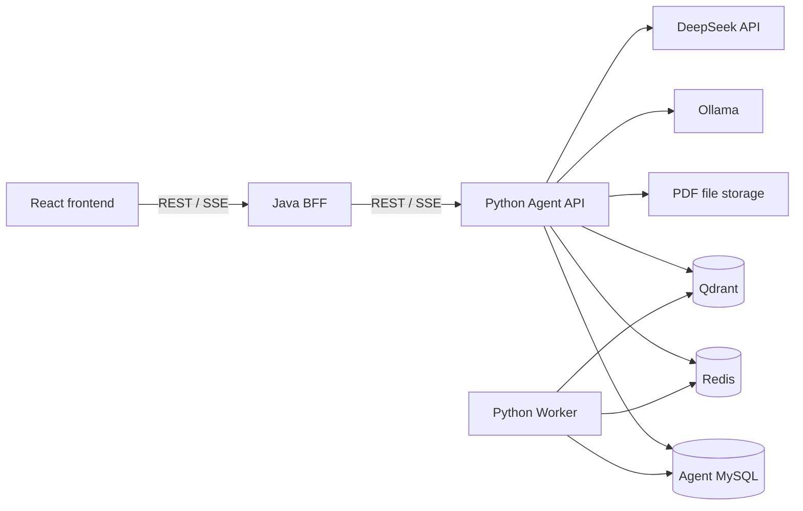

# AIResearcher 架构边界

## 1. 核心概念

- **软件项目**：整个 AIResearcher GitHub 仓库。
- **知识库**：长期保存和检索论文的 RAG 数据集合。第一版只有一个默认知识库。
- **研究工作区**：围绕研究问题保存文献矩阵、方向、实验和论文草稿的长期能力，Demo 后再引入。

AIResearcher 是一个仓库，但包含三个可独立启动的应用：

```text
AIResearcher/
├─ frontend/          React Web 客户端
├─ backend/           Java Web Backend/BFF
├─ agent/             Python Agent API、RAG 与 Worker
├─ contracts/         三端共享 API/SSE 契约
├─ infrastructure/    本地基础设施配置
├─ docs/              公开架构与开发文档
├─ scripts/           开发和验证脚本
└─ .github/           CI 与仓库协作配置
```

## 2. 运行关系



### React

- 提供知识库和问答页面。
- 负责浏览器交互、状态展示、流式文本和引用呈现。
- 只访问 Java `/api/v1/**`，不得直接调用 Python 或基础设施。

### Java

- 作为 Web Backend/BFF，对浏览器提供统一入口。
- 负责请求校验、Web DTO、`Result<T>`、错误映射、超时、请求追踪和 SSE 转发。
- 使用 AgentClient 调用 Python，不承担 PDF 解析、向量、RAG、Prompt 或模型逻辑。
- 没有 Java 自有持久化需求时不创建重复论文表或 Mapper。

### Python Agent

- 是论文与 AI 数据的唯一事实来源。
- 管理论文文件和元数据、任务、chunk、索引、会话、消息、引用、AI Run 与模型调用记录。
- 承担 PDF 解析、检索、Prompt、防提示注入规则和模型提供商适配。
- 不读取 Java 数据库，不依赖 Java 代码。

## 3. 数据边界

`infrastructure/` 只提交启动配置、`.env.example`、健康检查与操作说明。运行数据使用 Docker Named Volume 或本机仓库外目录。

允许提交：

- Docker Compose 和非敏感配置模板。
- Flyway/Alembic 迁移。
- 合成、可再分发的测试数据。
- 启动、备份和重置说明。

禁止提交：

- MySQL/Redis/Qdrant 数据。
- PDF 和用户上传文件。
- API Key、密码、Token、`.env`。
- 下载模型、缓存、日志和私有研究材料。

Python 后续使用 `airesearcher_agent` 数据库。Java 预留 `airesearcher_web`，但只在出现 Java 自有数据时创建。

## 4. API 与契约边界

- 浏览器调用 Java：`/api/v1/**`。
- Java 调用 Python：`/agent-api/v1/**`。
- Agent API 由 Python 实现、Java 消费。
- Web API 由 Java 实现、React 消费。
- OpenAPI、SSE Schema、事件示例与说明保存在 `contracts/`，先于实现修改。
- 已发布版本的破坏性变化必须创建新版本，不得直接覆盖。

普通 Java JSON API 使用 `Result<T>`；SSE、PDF 下载和 Actuator 不包装该结构。Phase 0 的机器可读契约由后续独立 contracts 任务冻结。

## 5. v0.1 范围

v0.1 只包含：

- 文本型 PDF 的批量上传、解析、元数据、去重、删除和重建索引。
- 单默认知识库的全库问答与多选论文限定问答。
- 多会话、SSE、页码引用以及论文证据与模型常识区分。
- 知识库页面和问答页面。

OCR、AI 摘要、人工笔记、arXiv、研究工作区、创新评估、实验闭环和论文写作不进入 v0.1。

## 6. 关键约束

- 仅 `READY` 论文可以参与检索。
- 删除论文必须清理当前文件、记录和向量；历史引用保留标题与页码快照并标记源已删除。
- 重建索引失败时旧索引继续可用，成功后才切换活动版本。
- PDF 内容是不可信输入，不得改变 Agent 规则或授权工具调用。
- 模型常识只能作为明确标记的补充，不能伪装为论文证据。
- Phase 0～3 的普通入库和 RAG 路径不使用 LangGraph。
