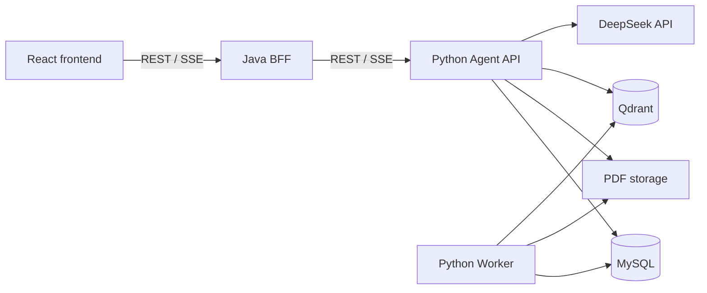

# AIResearcher 当前架构

本文只描述已经落地的系统结构和运行约束。尚未实现的能力及进入顺序见
[阶段路线图](roadmap.md)。

## 1. 系统组成

AIResearcher 是一个单仓库中的三个应用：

```text
AIResearcher/
├─ frontend/          React Web 客户端
├─ backend/           Java Web Backend/BFF
├─ agent/             Python Agent API、RAG 与 Worker
├─ contracts/         Agent API、Web API 与 SSE 契约
├─ infrastructure/    本地 MySQL 与 Qdrant 配置
├─ scripts/           开发启动与验证脚本
└─ docs/              架构、路线图与部署文档
```



浏览器不得绕过 Java 直连 Python。Java 不直接访问 MySQL、Qdrant 或 PDF storage。

## 2. 应用边界

### React Frontend

- 提供知识库、论文详情/PDF 预览和问答页面。
- 展示入库状态、工具状态、流式回答和页码引用。
- 只调用 Java 的相对路径 `/api/v1/**`。
- POST SSE 使用 `fetch` 解析；PDF 预览使用浏览器原生能力。

### Java Backend/BFF

- 为浏览器提供统一的 REST、PDF 和 SSE 入口。
- 负责 Web DTO、请求校验、`Result<T>`、错误映射、请求 ID、超时和下游取消。
- 通过 Agent client 调用 Python，并保持 PDF Range 与 SSE 事件语义。
- 不解析 PDF、不生成向量、不拥有 Prompt 或模型逻辑，也不建立重复的论文数据库。

### Python Agent

- 是论文文件及 AI 领域数据的唯一事实来源。
- 管理论文、入库任务、chunk、会话、消息、Run、工具调用和引用。
- 承担 PDF 解析、embedding、Qdrant 检索、Rerank、Tool Calling、Prompt 和模型适配。
- 通过独立 Worker 使用 MySQL 持久任务与租约执行后台入库。
- 将 PDF、用户输入和工具输出视为不可信内容，不允许其改变系统规则或工具权限。

## 3. 当前数据流程

### PDF 入库

1. 浏览器通过 Java 上传单个文本型 PDF。
2. Java 校验 Web 请求并把文件转发给 Python。
3. Python 将临时上传写入 `AIRESEARCHER_STORAGE_DIR/uploads/`，完成校验后保存到
   `AIRESEARCHER_STORAGE_DIR/papers/`。
4. Python 在 MySQL 中登记论文和入库任务。
5. Worker 领取任务，使用 PyMuPDF 按页解析和切块。
6. Worker 使用 BGE-M3 生成 embedding，并写入 Qdrant。
7. 成功后论文进入 `READY`；失败任务保留稳定错误信息并可重试。

### 流式问答

1. 浏览器经 Java 发起 POST SSE 请求。
2. Python 创建 Agent Run，并由 DeepSeek 原生 Tool Calling 决定是否调用只读工具。
3. `knowledge_base_search` 从 Qdrant 召回候选 chunk，再使用本地 reranker 排序。
4. 工具证据携带 paper、page、quote、chunk 和 citation ID。
5. Python 只接受能够映射到本轮工具证据的论文引用。
6. Java 原样转发 SSE 事件，React 展示工具状态、回答和可跳页引用。

## 4. 数据与存储边界

当前本地运行使用以下位置：

| 数据 | 位置 |
| --- | --- |
| PDF 与上传临时文件 | `AIRESEARCHER_STORAGE_DIR` 指向的仓库外目录 |
| 模型缓存 | `AIRESEARCHER_MODEL_CACHE_DIR` 指向的仓库外目录 |
| Agent 关系数据 | Docker named volume `airesearcher_mysql_data` |
| Qdrant 向量 | Docker named volume `airesearcher_qdrant_data` |
| 本机秘密 | 被 Git 忽略的根目录 `.env` |

`infrastructure/` 只保存 Compose 配置，不保存数据库或向量运行数据。当前 Java 没有业务
持久化；只有未来出现明确属于 Web 层的登录、租户等数据时才重新评估。

允许提交非敏感配置模板、迁移、合成测试数据和公开文档。禁止提交真实 PDF、研究数据、
API Key、密码、Token、数据库、向量、模型、缓存和日志。

## 5. API 与契约

- 浏览器调用 Java：`/api/v1/**`。
- Java 调用 Python：`/agent-api/v1/**`。
- 普通 Java JSON API 使用 `Result<T>`；Agent JSON API 使用直接 DTO。
- SSE、PDF 下载和健康检查不包装 `Result<T>`。
- PDF 代理保留 `Range`、`Content-Range`、`Content-Length`、`Content-Type`、
  `Accept-Ranges` 和 `ETag` 等必要语义。
- SSE 契约定义事件名、事件 ID、序号、payload、顺序以及唯一终止事件。

`contracts/` 保存已接受的目标契约。契约可以先于消费者实现合入，因此必须在
[路线图](roadmap.md)中标明实施状态；不能仅因契约存在就宣称功能已经可用。

## 6. 运行不变量

- 只有完成入库并处于 `READY` 的论文能够参与当前检索。
- chunk 不跨 PDF 页，论文证据必须能够回溯到 paper、page、quote 和 chunk。
- Worker 使用任务租约和确定性向量 ID 保证重试幂等；失败任务不得把论文标记为
  `READY`。
- 模型只能把当前工具结果中的 citation ID 输出为论文证据。
- 普通模型回答必须与论文证据明确区分。
- Java 保持无论文业务持久化，Python 不读取或依赖 Java 内部代码。

## 7. 后续演进边界

下一项已接受目标是本地论文原件库，包括目录扫描、原件状态、排除/恢复和统一登记边界。
这些能力当前尚未进入运行架构，其实施范围和完成条件统一维护在路线图阶段 1.4。实现完成并
通过三端验证后，再将本文件更新为新的当前架构。
